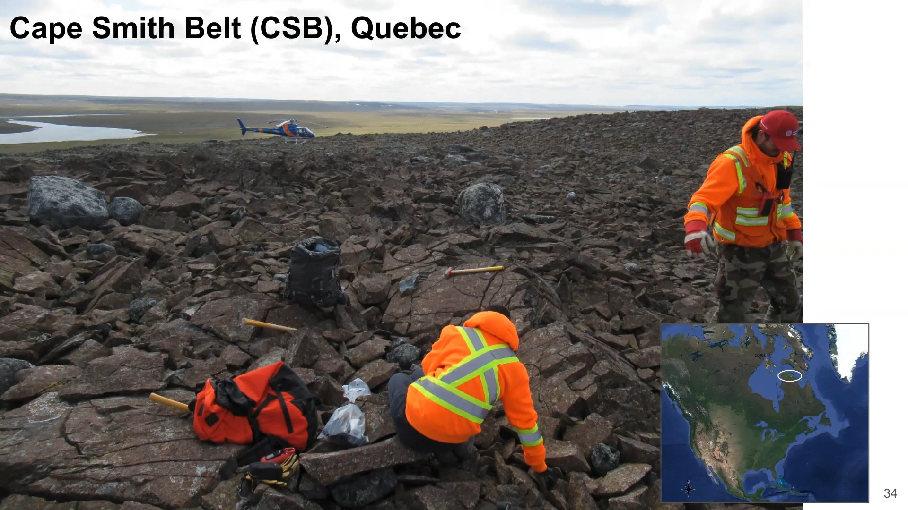
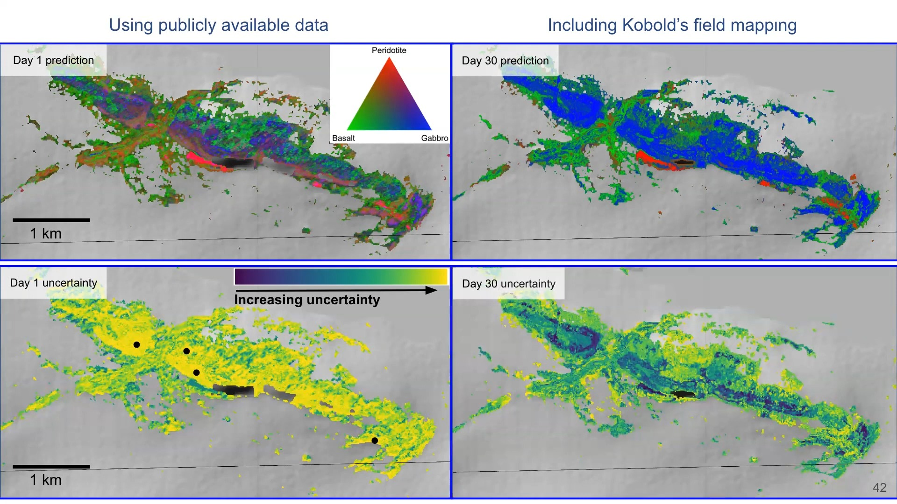

# AI (para mis amigos): Supporting the Green Revolution by Discovering Metal Deposits Deep Underground

## Problem

The transition to a greener future, in particular the EV (electric vehicle) revolution, is massively dependent on 4 key elements in the periodic table: Copper, Lithium, Cobalt, and Nickel. Why?

* **Copper** - the workhorse of the transition - is the principal electron carrier in almost all electricity applications. An EV requires 3 times more copper (by mass) compared to an equivalent internal combustion car (a gasoline-fuelled vehicle).
* **Lithium** is the most desired anode material in a battery. It's the lightest metal and has a high propensity to lose an electron, which is necessary to produce energy within the battery. The next best alternative - sodium-ion batteries - are significantly inferior since sodium's mass is 3 times that of lithium and sodium is less willing to lose electrons, meaning it produces less energy per unit of mass. In essence, lithium is an absolute must for EVs!
* **Cobalt** and **nickel** are the best cathode materials since their chemical properties make them great receivers of electrons. Despite cobalt offering optimal battery performance, nickel is widely used since it overcomes widely known ethical issues surrounding cobalt. Sadly, the Democratic Republic of Congo, where many mines force children in their early teens to work in horrendous conditions, dominates global cobalt production with a market share of over 60%. It must also be noted that Russia is the second biggest producer of both cobalt and nickel. I need not explain the political motivations for discovering large deposits of both metals - fast!

What's the problem? Supply and demand forecasts suggest we are simply not aware of enough metal to meet demand.

1. **Demand**: By mid-century, demand - compared to today's baseline - is predicted to grow x30 for lithium, x15 for cobalt, x5 for nickel, and x2 for copper (a massive increase considering copper is already a $100bn market).
2. **Supply**: If you keep fishing in the same pond, eventually you'll run out of big fish to catch. The small fish won't be economical to catch, transport and sell, and you'll be forced to stop fishing. In this context, the fish are metals and the pond is the Earth's crust. Historically, we've not searched for metal beneath the top 100m of Earth's crust. Hence, our finite supply is depleting at a worrying rate and it's time to deepen the pond.

KoBold Metals was founded in 2018 to address the crippling battery metals bottleneck. They estimate a supply gap - by mid-century - worth over $15 trillion (based on commodity prices as of March 2023). For clarity, they mean $15 trillion of new discoveries (after we have mined all known deposits first). Their goal is to revolutionise the search for deposits by looking 100s of meters beneath Earth's crust...and they plan to use AI to do it!

## Exploration: Example

### Aim

Your goal is to create a map of a region no one has ever visited before. All you have at your disposal is a plane, 4 parachute jumpers, and devices enabling the crew to communicate.

### Prior knowledge

You begin by flying the plane at 10,000m; traversing the whole region like a counter advancing through a snakes and ladders board. At this altitude, your ability to draw confident conclusions is limited. Hence, you assign subjective probabilities to regions. "I think the probability of the big blue region being the sea is 98%." Are the white regions snow, sand dunes, or salt flats? White regions immediately beside the sea are more likely to be sand dunes than anything else. Moreover, snow is more likely to be found at higher altitudes, so you look for mountains when distinguishing from salt flats. After flying over the entire region, you create a first draft of the map with your team. In some parts you're very confident, others you're not. How do you increase the confidence in your observations?

### Exploration

Of course, you drop the 4 parachuters! As they fall, the radius of their visual field shrinks but they are more confident in their observations since they are closer to the ground. This creates regions of varying uncertainty on the map. 

Why keep each parachuter's belief separate from one another? If all 4 parachuters could see the same spot during their fall and they concluded a green region was a grassland, your team can be very confident in their conclusion. Now, a trade-off exists: spread the parachuters out (resulting in non-overlapping views) to cover a more expansive area but have less confidence in your conclusions, or cover less area but have more confidence in your conclusions. Does an optimal strategy exist?

Most likely! Prior to dropping the parachuters, you had a draft map of the world (called your "prior" knowledge). Recall, your prior was confident that the blue region visible from the plane is the sea. Is it wise to drop parachuters there? No, of course not! Dropping your team where uncertainty is greatest is optimal. You want each resource (each parachuter) to provide as much new information as possible.

The overarching principle is: build a prior knowledge of the world using all tools at your disposal, then decrease your uncertainty as much as possible through exploration with the limited resources you have.

## Exploration: Kobold Metals

### Aim

Similarly to the example provided, Kobold Metals' aim is to create a highly informartive map. Although, in their case, they want their map to indicate the presence of subsurface metal.

### Prior knowledge

In the example given, the map represented visible light and the only measuring device employed was the human eye. Fortunately, Kobold Metal uses tools far more capable than the human eye and they use data types far more informative than visual light. Types of data they collect are:

- **Spectral imagery**: Spectral imagery can be visible light, UV light, infrared light, and more.
- **Magnetic**: Anomalies in magnetic maps that cannot be explained by Earth's magnetic field alone can indicate the presence of metal.
- **Radiometrics**: Rocks are continuously decaying and omitting radioactive decay products. Certain products can indicate the presence of certain metals.
- **Electromagnetic**: Provides information about the conductivity of the surface. An electromagnetic sensor emits electromagnetic waves into the ground or rocks. These waves induce currents in conductive materials within the Earth's subsurface and the sensor measures the secondary electromagnetic fields generated by these currents.
- **Gravity**: Density contrasts - a significant change in the density of materials beneath the surface - often indicate the presence of large geological deposits. Such structures create gravitational anomalies due to the increase in gravitational attraction caused by the denser material.
- **Induced polarisation**: Provides information about the inductive properties of the minerals. Data is collected by applying alternating electrical currents to the ground and measuring the voltage response. Minerals containing the elements of interest have notable chargeability.

This stage of the process is key. As with all tasks in data science, the value is in the data itself. When AI processes the data it is more than capable of finding clues of metal deposits, but you have to create the clues in the first place by making sure they're present in the data.

### Exploration

There are plenty of sites where Kobold are searching for metals, but here I focus on their exploration at a site in Quebec, Canada.

<figure>
  
  <figcaption style="text-align:center;">The extremely remote Cape Smith. 
  Image credit to Kobold CEO Kurt House's 
  <a href="https://www.youtube.com/watch?v=ERjBgQuyJ7A">talk</a></figcaption>
</figure>

The Cape Smith Belt, Quebec is a a complex geological structure comprised of a variety of rocks over 1.9 billion years in age. It is a super remote and beautiful area, making it a popular destination for hiking, camping, and fishing. The remote location imposes immense challenges in terms of logistics and cost. Everything - drilling equipment, personnel, survival supplies, etc. -  must be flown in. Moreover, all samples taken by drilling into the rock must be flown out for testing. The climate presents further issues: there's snow on the ground nine months a year leaving only three months to collect samples.

Across a 1000sq km (200,000 acres) region searched by Kobold Metals, 5 tonnes of samples were collected in just under three months. Here, we're talking about digging rock samples equivalent in mass to only 4 hatchback cars in a region comparable to 98,000 football pitches - absolutely nuts! Not to mention we aren't just considering rock at the surface, but minerals buried deep underground too! The fraction of mass in the area that can be collected is absolutely tiny. Hence, it is vital to collect the best type of information in the best locations.

Similarly to the example - where you chose not to drop parachutes in an area you were already confident was the sea - KoBold Metals were guided by their uncertainty. They took samples in 4 locations where uncertainty was greatest. By analysing the geochemistry of these samples, they could make extremely confident conclusions about the material in the ground. After using statistical methods to combine new data with their prior, they formed a new belief about the geochemistry of the whole Cape Smith Belt.

<figure>
  
  <figcaption style="text-align:center;">An image depicting the change in uncertainty as a resutt of the drilling at the Cape Smith Belt. The 4 black circles in the Day 1 uncertainty indicate the drilling locations. The land is being classified into 3 classes, with green, blue, and red used for each class. The Day 30 prediction appears a higher resolution version of the Day 1 prediction, due to the decrease in uncertainty. Image credit to Kobold CEO Kurt House's 
  <a href="https://www.youtube.com/watch?v=ERjBgQuyJ7A">talk</a>
  at Stanford University.
  </figcaption>
</figure>

During their 3-month exploration project, dozens of previously unmapped, high-grade mineral occurrences were discovered. As a result, millions of dollars are being invested into more advanced drilling campaigns during 2023. Returning to the example in the introduction, Kobold Metals have found fish, but they now need to determine if they'll be economical to catch, transport, and sell. Who knows, if all goes well and they find deposits economical to mine, they might just mine the battery metals that end up in your future EV!

## The Big Picture

I have only touched on the entire exploration process here. There are so many more scientific challenges faced throughout the search for mineral deposits. To learn more about the end-to-end process, watch the video that inspired the blog below.

<iframe width="560" height="315" src="https://www.youtube.com/embed/ERjBgQuyJ7A?si=KtJxUY8DrMYmPoCT" title="YouTube video player" frameborder="0" allow="accelerometer; autoplay; clipboard-write; encrypted-media; gyroscope; picture-in-picture; web-share" allowfullscreen></iframe>

## A Note on Sustainability

I know what you sustainability heads are thinking...support the green revolution by building additional mines and further disrupting the beautiful planet - what a joke! Hear me out...

Drilling for fossil fuels and burning them to produce energy is a singular economy. Carbon is released into the atmosphere where it remains for a very, very long time. Whereas, drilling for metals to produce EV batteries can facilitate a circular economy on a gigantic scale. It's possible to achieve a 98+% recycling rate on the metals contained in batteries; high enough to almost stop mining metal altogether! But, we must extract the metals from the ground and funnel them into the system first. This will take 50 years or so -  hold tight!

